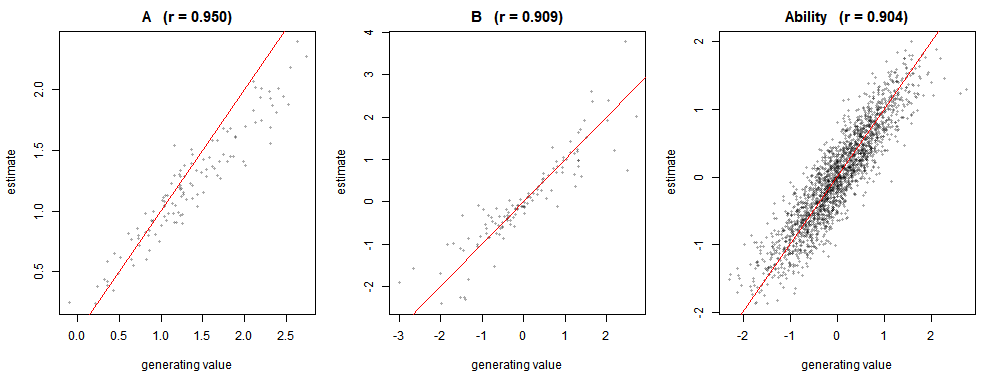
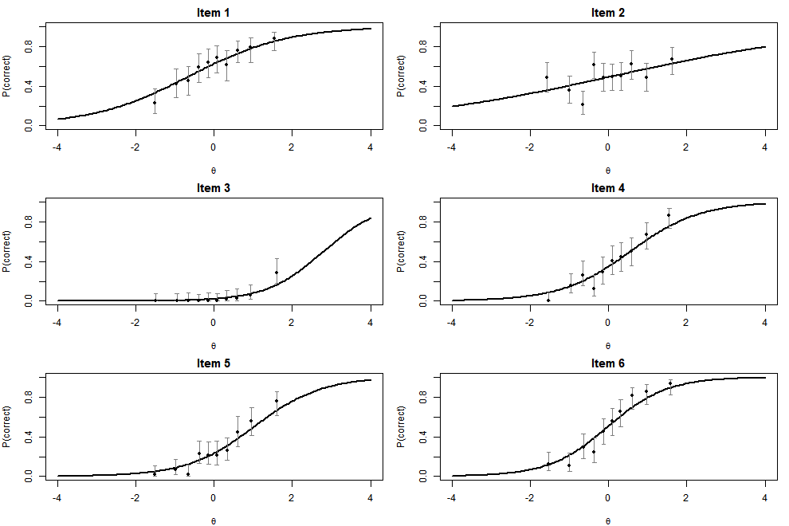
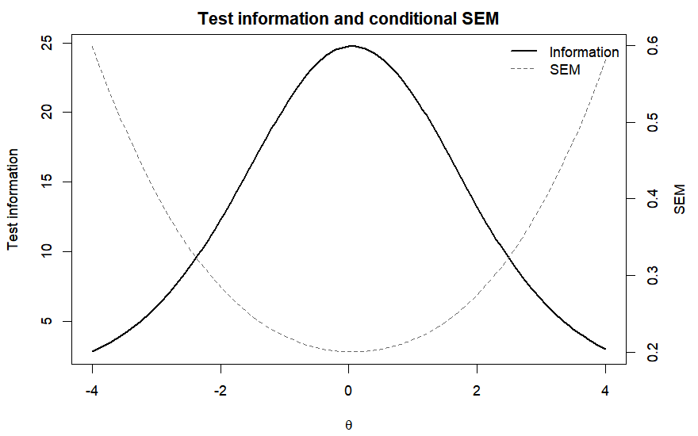
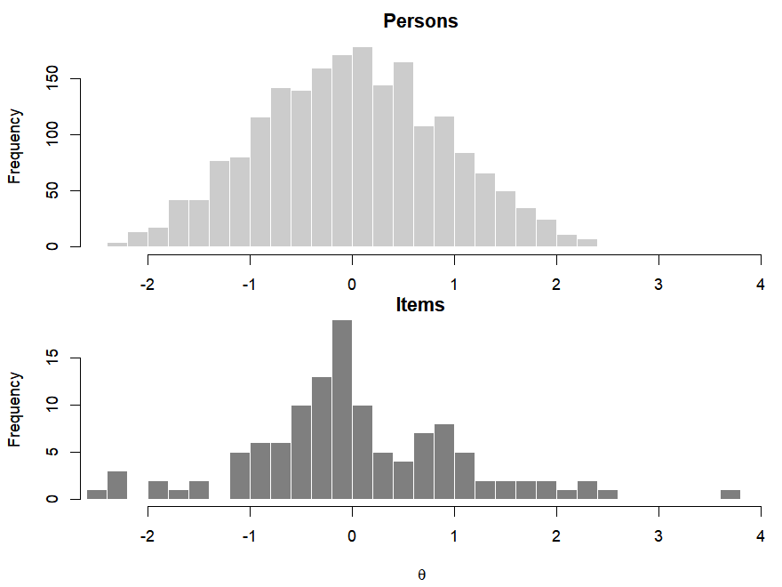
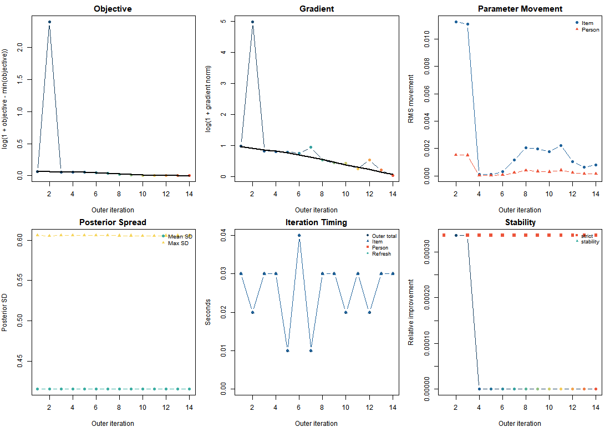

# bigIRT

<!-- badges: start -->

[](https://github.com/cdriveraus/bigIRT/actions/workflows/R-CMD-check.yaml)
<!-- badges: end -->

Item response theory for large, sparse response sets in long format.
bigIRT fits binary 1PL to 4PL models by marginal maximum likelihood,
using a Laplace approximation for the integral over person abilities. It
works one response row at a time and never builds the wide
person-by-item matrix, so millions of responses and hundreds of
thousands of people are an ordinary input.

What is implemented:

|  |  |
|----|----|
| **Models** | 1PL, 2PL, 3PL, 4PL |
| **Estimation** | Marginal ML, Laplace approximation (`marginalApprox = "laplace"`) |
| **Person covariates** | On ability, varying between *or within* a person |
| **Item covariates** | On any of the four item parameters, shared or item-specific |
| **Multiple dimensions** | Several scales at once, confirmatory loading patterns, estimated latent correlation |
| **Priors** | Fixed, or hyperparameters estimated from the data (`ebayes`) |
| **Validation** | Response-level or whole-person holdout, PSIS-LOO, AIC/BIC |
| **Diagnostics** | Item and test information, standard errors, empirical ICCs, infit/outfit, reliability, convergence by parameter block |
| **Interop** | `mirt` in both directions, `broom` tidiers, HTML report |

## Install

On Windows, first install Rtools:
<https://cran.r-project.org/bin/windows/Rtools/>

``` r
remotes::install_github('cdriveraus/bigIRT',
  INSTALL_opts = "--no-multiarch",
  dependencies = c("Depends", "Imports"))
```

## The data

One row per response. You need a person column, an item column, a scale
column, and a binary score; anything else in the data can be used as a
covariate. `simIRT()` generates data in exactly this shape:

``` r
library(bigIRT)
library(data.table)

set.seed(1)
sim <- simIRT(Nsubs = 2000, Nitems = 120, Nscales = 1, NitemsAnswered = 30,
  AMean = 1, ASD = .4, BMean = 0, BSD = 1,
  logitCMean = -20, logitCSD = 0, logitDMean = 20, logitDSD = 0)

dat <- data.table(sim$dat)
head(dat[, .(id, Item, Scale, score)])
#>       id  Item Scale score
#>    <int> <int> <int> <int>
#> 1:     1    46     1     1
#> 2:     1   106     1     1
#> 3:     1    20     1     1
#> 4:     1   119     1     0
#> 5:     1    68     1     0
#> 6:     1    38     1     1
```

2,000 people answered 30 of 120 items each: 60,000 rows out of a
possible 240,000. Column names are arguments, so your own names are fine
(`fitIRT(dat, id = "student", item = "code", score = "correct")`).

## Fitting

``` r
set.seed(2)
train <- sample(nrow(dat), 0.9 * nrow(dat))   # hold a tenth back

tm <- system.time(
  fit <- fitIRT(dat, pl = 2,
    marginalApprox = "laplace",   # pass this: the default is the old MAP path
    trainingRows = train,
    keepInternals = TRUE,         # keep what standard errors need
    laplaceDiagnostics = TRUE,    # keep the optimiser trace for plotting
    cores = 2, dropPerfectScores = FALSE, normalise = FALSE,
    verbose = 0, plot = FALSE)
)

fit
#> bigIRT fit: laplace backend | 2000 persons, 120 items, 1 dimensions
#> Objective: -29518.107116
#> Laplace: strictly converged after 8 iteration(s) [approx_gradient]
#> Note: direct Laplace uses approximate global derivatives.
```

That is 3.2 seconds for 60,000 responses on two cores. **Always check
the status line.** `strictly converged` is what you want; anything else
means read `fit$laplaceStatus` and `checkConvergence()` before using the
numbers.

`summary()` gives the item parameters, their standard errors, the
effective parameter count, reliability and the held-out prediction
together:

``` r
summary(fit)
#> bigIRT summary (laplace backend)
#> 2000 persons, 120 items, 60000 responses, 1 dimension(s)
#> Termination: approx_gradient
#> AIC (effective df): 62604.8
#> 
#> Item parameters:
#>        A                B                  C           D    
#>  Min.   :0.1902   Min.   :-2.41200   Min.   :0   Min.   :1  
#>  1st Qu.:0.7294   1st Qu.:-0.54973   1st Qu.:0   1st Qu.:1  
#>  Median :0.9430   Median :-0.11616   Median :0   Median :1  
#>  Mean   :0.9667   Mean   : 0.03078   Mean   :0   Mean   :1  
#>  3rd Qu.:1.1693   3rd Qu.: 0.66338   3rd Qu.:0   3rd Qu.:1  
#>  Max.   :1.9110   Max.   : 3.77253   Max.   :0   Max.   :1  
#> Median standard error: B 0.110  A 0.218  (about 6% small; see ?itemInformation)
#> Effective item parameters: 223.7
#> 
#> Abilities:
#>        1             
#>  Min.   :-2.3461193  
#>  1st Qu.:-0.6463295  
#>  Median :-0.0031408  
#>  Mean   :-0.0005127  
#>  3rd Qu.: 0.6065587  
#>  Max.   : 2.4994848  
#> 
#> Reliability:
#>  scale mean_error_variance observed_variance empirical  marginal  mean_sem
#>      1           0.1741038         0.8018958 0.8216149 0.8258962 0.4172575
#> 
#> Held out (6000 responses): log loss 0.5609, Brier 0.1920 (base rate 0.2197), AUC 0.776
```

Against the parameters `simIRT()` generated (`normaliseIRT()` first,
since estimated and generating parameters sit on different metrics):

``` r
truth <- normaliseIRT(B = sim$B, Ability = sim$Ability, A = sim$A)
est   <- normaliseIRT(B = fit$itemPars$B, Ability = fit$pars$Ability,
                      A = fit$itemPars$A)

local({
  op <- par(mfrow = c(1, 3), mar = c(4.2, 4.2, 2.2, 1)); on.exit(par(op))
  for(p in c("A", "B", "Ability")){
    r <- cor(as.numeric(truth[[p]]), as.numeric(est[[p]]))
    plot(truth[[p]], est[[p]], pch = 16, cex = .5, col = "#00000055",
      xlab = "generating value", ylab = "estimate",
      main = sprintf("%s   (r = %.3f)", p, r))
    abline(0, 1, col = "red")
  }
})
```



### What comes back

|  |  |
|----|----|
| `fit$itemPars` | One row per item: `Item`, `A`, `B`, `C`, `D` |
| `fit$personPars` | One row per person: `id`, one ability column per scale, one posterior SD per scale |
| `fit$pars$Ability` | Ability point estimates, persons x scales |
| `fit$covariateEffects` | Covariate effects, raw (`$Ability`) and standardised (`$AbilityStd`) |
| `fit$pars$Abilitybeta` | Person-covariate coefficients, as estimated |
| `fit$pars$Bbeta`, `$Abeta`, `$Cbeta`, `$Dbeta` | Item-covariate coefficients |
| `fit$pars$pcorrect` | Per-response probability of a correct answer, in *your* row order |
| `fit$pars$p` | Per-response probability of the response actually observed |
| `fit$abilityPrior$corr` | Latent correlation between scales |
| `fit$personPosterior` | Person modes, precisions, covariances, per-person convergence |
| `fit$laplaceStatus` | Convergence status, iterations, stop reason |
| `fit$optim$logLik` | Optimiser objective. For a likelihood use `logLik(fit)` |

`fit$pars$pcorrect` and `fit$pars$p` are mapped back to the row order of
the data you passed in, so they index with the same row numbers you used
for `trainingRows`. Scoring the held-out rows by hand reproduces what
`heldoutMetrics()` reports, which is the check that the mapping is
right:

``` r
heldout <- setdiff(seq_len(nrow(dat)), train)
brier <- mean((dat$score[heldout] - fit$pars$pcorrect[heldout])^2)

c(by_hand = brier, heldoutMetrics = heldoutMetrics(fit)$brier)
#>        by_hand heldoutMetrics 
#>      0.1919634      0.1919634
```

Other row-level output (`b_row`, `eta_row`, `row_ability`, `fit$dat`)
stays in the internal person-sorted order. `fit$pars$originalRow` maps
between the two.

### Arguments worth knowing

|  |  |
|----|----|
| `pl` | 1 to 4. Number of item parameters |
| `marginalApprox` | `"laplace"`. `"laplace_fast"` and `"laplace_direct"` are accepted names for the same thing |
| `cores` | Threads used for fitting |
| `trainingRows` | Rows used for estimation. See [Validation](#validation) |
| `personPreds` | Column names of ability covariates |
| `AitemPreds`, `BitemPreds`, `CitemPreds`, `DitemPreds` | Column names of item covariates |
| `itemSpecificBetas` | `FALSE` (default) for one coefficient per predictor, `TRUE` for one per item |
| `loadings` | Item x scale matrix. Fixed values, `NA` to estimate |
| `estimateAbilityCorr` | Estimate the latent correlation between scales |
| `ebayes` | `TRUE` (default) estimates the prior hyperparameters from the data |
| `dropPerfectScores` | Drops all-right and all-wrong people and items before fitting |
| `keepInternals` | Needed by `itemInformation()` and the tidiers |
| `laplaceDiagnostics` | Keeps the optimiser trace for `plot(fit, "convergence")` |
| `laplaceKeepCovariance` | Keeps full person posterior covariances. Needed by `looIRT()`. Large |

## Diagnostics and plots

`plot()` on a fit takes a `type`. Response curves come with the observed
proportions in ability bins and their Wilson intervals, so you are
comparing the model against the data:

``` r
plot(fit, type = "icc", items = 1:6)
```



Item 2 barely discriminates, and item 3 does not start rising until the
top of the ability range, so almost nobody who saw it got it right.

Test information and the conditional standard error of measurement show
where the test actually measures:

``` r
plot(fit, type = "information")
```



A person-item map compares where the people are with where the items
are:

``` r
plot(fit, type = "wright")
```



The isolated item out near 3.8 is item 3 from the panel above. This is
how you find those without looking at every curve.

`itemFit()` gives infit and outfit in one pass over the responses, and
`reliability()` the empirical and marginal coefficients:

``` r
head(itemFit(fit))
#>   item   n     infit    outfit     outfit_t
#> 1    1 425 0.9566765 0.9434826  -0.81703707
#> 2    2 447 1.0028412 1.0036789   0.07722872
#> 3    3 462 0.8510496 0.3604825 -13.12357594
#> 4    4 443 0.9189603 0.8730436  -1.95320541
#> 5    5 470 0.9263108 0.8520511  -2.36833051
#> 6    6 469 0.8847194 0.8481320  -2.43264074
reliability(fit)
#>   scale mean_error_variance observed_variance empirical  marginal  mean_sem
#> 1     1           0.1741038         0.8018958 0.8216149 0.8258962 0.4172575
```

Item 3 shows up here too, with an outfit far below 1: its responses are
more predictable than the model expects, because almost nobody who saw
it got it right.

`itemInformation()` gives per-item standard errors and an effective
parameter count. The default `method = "auto"` uses a fast closed-form
weight, and switches to differencing the analytic gradient (exact, but
two objective evaluations per parameter) when the projected cost fits
`time_budget`.

``` r
itemInformation(fit)
#> bigIRT item information: 120 items, blocks [B, A]
#> Standard errors are posterior (the fit is penalised by priors), by the hessian method.
#> Effective parameters: 240.0 of 240
#>        B                 A         
#>  Min.   :0.09494   Min.   :0.2059  
#>  1st Qu.:0.10465   1st Qu.:0.2208  
#>  Median :0.11243   Median :0.2299  
#>  Mean   :0.12261   Mean   :0.2417  
#>  3rd Qu.:0.12308   3rd Qu.:0.2491  
#>  Max.   :0.33993   Max.   :0.3539
```

`testInformation()` returns information and the conditional SEM on a
theta grid, and `empiricalICC()` returns the binned
observed-versus-expected table behind the first plot. Both are row-wise,
so they run at any data size.

### Convergence

Read this as numbers, not only as a picture. `checkConvergence()` splits
the gradient by parameter block, which is how you find a fit that
reports convergence but is stalled on one small block:

``` r
checkConvergence(fit)
#> bigIRT convergence: converged (approx_gradient)
#> Scaled total gradient: 7.649e-07 over 242 parameters
#> Newton decrement: 1.089e-05  (objective still available: 5.445e-06)
#> Worst parameter: A[9] at 0.002 standard errors from stationary
#> 
#> By block:
#>   block   n      norm   max_abs       rms  share
#>  A_mean   1 0.0204400 0.0204400 0.0204400  81.9%
#>       A 120 0.0094240 0.0067070 0.0008603  17.4%
#>       B 120 0.0017820 0.0004052 0.0001627   0.6%
#>  B_mean   1 0.0003393 0.0003393 0.0003393   0.0%
```

`plot(fit, "convergence")` draws the optimiser’s trace: objective,
gradient norm, how far the item and person blocks moved, posterior
spread, timing, and the two stopping criteria.

``` r
plot(fit, type = "convergence")
```



## Validation

`trainingRows` selects the rows used for estimation; everything else is
scored as holdout by `heldoutMetrics()`.

``` r
unlist(heldoutMetrics(fit))
#> heldout_responses          log_loss             brier               auc          accuracy 
#>      6000.0000000         0.5608951         0.1919634         0.7763323         0.6966667 
#>   item_base_brier 
#>         0.2196962
```

`IRTic()` gives AIC and BIC with the person parameters correctly not
counted, and `looIRT()` runs PSIS-LOO over draws from the person
posteriors (refit with `laplaceKeepCovariance = TRUE` first).

``` r
IRTic(fit)
#>   criterion   df_type    n_type  df    value
#> 1       AIC effective      <NA> 242 62604.76
#> 2       AIC   nominal      <NA> 242 62604.76
#> 3       BIC effective   persons 242 63960.18
#> 4       BIC   nominal   persons 242 63960.18
#> 5       BIC effective responses 242 64783.27
#> 6       BIC   nominal responses 242 64783.27
```

**Whole people can be held out**, not just responses: a person with no
training response has the prior as their posterior, so their fitted
ability is exactly what their covariates predict. That is the design
that tests whether covariates say anything about somebody the model
never saw, and there is an example in [Covariates](#covariates) below.
Items are not symmetric here — every item must keep at least one
training response, since nothing else identifies it.

## Covariates

Ability covariates are column names passed to `personPreds`. They are
aligned to response rows, not to people, so a covariate may vary
*within* a person — which is what makes longitudinal designs work. Here
`ses` is fixed per person and `t_dev` is a person-centred time score,
giving a between-person and a within-person effect from one fit:

``` r
set.seed(7)
N <- 1500; J <- 150; per <- 24; occ <- 4L
A <- rlnorm(J, 0, .25); B <- rnorm(J, 0, 1)
theta <- rnorm(N); sesv <- rnorm(N)

d <- data.table(id = rep(seq_len(N), each = per))
d[, occasion := rep(seq_len(occ), length.out = .N), by = id]
d[, t_dev := (occasion - 1) / (occ - 1) * 2]
d[, t_dev := t_dev - mean(t_dev), by = id]    # varies only within a person
d[, ses := sesv[id]]                           # varies only between persons
d[, Item := sample.int(J, .N, replace = TRUE)]
d[, Scale := "s1"]

ability <- theta[d$id] + 0.4 * d$t_dev + 0.3 * d$ses
d[, score := rbinom(.N, 1, 1 / (1 + exp(-A[Item] * (ability - B[Item]))))]

fitcov <- fitIRT(d, pl = 2, cores = 2, marginalApprox = "laplace",
  personPreds = c("ses", "t_dev"),
  dropPerfectScores = FALSE, normalise = FALSE, verbose = 0, plot = FALSE)

rbind(estimated = drop(fitcov$covariateEffects$Ability), true = c(0.3, 0.4))
#>                 ses     t_dev
#> estimated 0.2836678 0.4177696
#> true      0.3000000 0.4000000
```

`fit$covariateEffects$AbilityStd` gives the same effects per standard
deviation of the predictor.

Item covariates work the same way through `AitemPreds`, `BitemPreds`,
`CitemPreds` and `DitemPreds`. With `itemSpecificBetas = FALSE` there is
one coefficient per predictor across all items, which is how you ask
whether a feature of an item — its position in the test, its format, its
language version — shifts difficulty in general:

``` r
fitb <- fitIRT(dat, pl = 2, marginalApprox = "laplace",
  BitemPreds = c("position", "isTranslated"))
fitb$pars$Bbeta
```

Two things to know when interpreting ability coefficients. The ability
mean is fixed at zero (`estMeans`), because location is pinned by either
the ability prior or the item difficulties and not both, so coefficients
are relative to that and there is no population offset to add back. And
an uncentred binary covariate is fine — its coefficient is then a
contrast against the reference group, which sits at the prior mean.

To ask whether the covariates say anything about people the model has
never seen, hold out whole people. Such a person has no likelihood, so
their ability is their covariate prediction and nothing else — which you
can check directly, comparing each person’s ability against their own
mean covariate values:

``` r
test_people <- sample(unique(d$id), 300)

fit_ho <- fitIRT(d, pl = 2, cores = 2, marginalApprox = "laplace",
  personPreds = c("ses", "t_dev"),
  trainingRows = which(!d$id %in% test_people),
  dropPerfectScores = FALSE, normalise = FALSE, verbose = 0, plot = FALSE)

pmean <- d[, .(ses = mean(ses), t_dev = mean(t_dev)), by = id]
pmean <- pmean[match(as.integer(fit_ho$personPars$id), pmean$id)]
pred  <- as.matrix(pmean[, .(ses, t_dev)]) %*% drop(fit_ho$pars$Abilitybeta)
gap   <- abs(as.numeric(fit_ho$pars$Ability) - as.numeric(pred))
held  <- as.integer(fit_ho$personPars$id) %in% test_people

c(held_out = max(gap[held]), in_training = max(gap[!held]))
#>    held_out in_training 
#>     0.00000     2.50499
```

Zero for the held-out people, and not for the others, whose abilities
their own responses inform.

Whether that prediction is worth anything is a separate question, and
one number cannot answer it — you need the same holdout without the
covariates to compare against:

``` r
fit_nocov <- fitIRT(d, pl = 2, cores = 2, marginalApprox = "laplace",
  trainingRows = which(!d$id %in% test_people),
  dropPerfectScores = FALSE, normalise = FALSE, verbose = 0, plot = FALSE)

rbind(
  `with covariates` = unlist(heldoutMetrics(fit_ho))[c("log_loss", "auc")],
  `without`         = unlist(heldoutMetrics(fit_nocov))[c("log_loss", "auc")])
#>                  log_loss       auc
#> with covariates 0.6022257 0.7393131
#> without         0.6121429 0.7248780
```

## Multiple dimensions

Give the data more than one `Scale` and the scales are fitted together.
Add `estimateAbilityCorr = TRUE` to estimate the latent correlation
rather than assume it:

``` r
trueR <- matrix(c(1, .7, .4,  .7, 1, .5,  .4, .5, 1), 3, 3)
set.seed(31)
simm <- simIRT(Nsubs = 2500, Nitems = 60, Nscales = 3,
  NitemsAnswered = c(10, 10, 10),
  AMean = 1, ASD = .2, BMean = 0, BSD = 1,
  logitCMean = -20, logitCSD = 0, logitDMean = 20, logitDSD = 0,
  AbilityCorr = trueR)

fitm <- fitIRT(simm$dat, pl = 2, cores = 2, marginalApprox = "laplace",
  estimateAbilityCorr = TRUE, ebayes = FALSE,
  dropPerfectScores = FALSE, normalise = FALSE, verbose = 0, plot = FALSE)

round(fitm$abilityPrior$corr, 2)
#>      [,1] [,2] [,3]
#> [1,] 1.00 0.70 0.37
#> [2,] 0.70 1.00 0.49
#> [3,] 0.37 0.49 1.00
```

**Report `fit$abilityPrior$corr`, not `cor(fit$pars$Ability)`.** The
correlation among ability point estimates is biased — downwards under an
independent prior, since each score is shrunk on its own, and upwards
under a correlated one, since the shrinkage pulls scores together.
Against the known truth:

``` r
rbind(estimate = fitm$abilityPrior$corr[lower.tri(trueR)],
      modes    = cor(fitm$pars$Ability)[lower.tri(trueR)],
      truth    = trueR[lower.tri(trueR)])
#>               [,1]      [,2]      [,3]
#> estimate 0.7023414 0.3689864 0.4870982
#> modes    0.8440560 0.4946423 0.6178932
#> truth    0.7000000 0.4000000 0.5000000
```

For structure within a scale set, pass a loading matrix. Fixed values
define the confirmatory pattern, `NA` entries are estimated, and rows
and columns are matched to item and scale ids by name:

``` r
L <- matrix(NA_real_, nrow = length(item_ids), ncol = length(scale_ids),
  dimnames = list(item_ids, scale_ids))
L[1, ] <- c(0.8, 0.2)   # fixed cross-loading
L[2, 2] <- 0            # fixed zero

fitL <- fitIRT(dat, pl = 2, loadings = L, marginalApprox = "laplace",
  estimateAbilityCorr = TRUE)
```

`loadingsFixed` takes over when you want an entry free at a chosen
starting value, or fixed at a value that is not `NA`. `normaliseMIRT()`
rotates and scales a multidimensional solution for comparison.

## Reporting and interop

`tidyIRT()`, `glanceIRT()` and `augmentIRT()` return tidy data frames,
and are registered against `broom`’s generics when broom is installed.
Standard errors are carried onto the reported parameter scale by the
delta method, since discrimination is estimated as a softplus pre-image
and the asymptotes as logits:

``` r
subset(tidyIRT(fit, conf.int = TRUE), item %in% c("1", "2", "3"))
#>     item term    estimate  std.error   conf.low  conf.high
#> 1      1    A  0.79812581 0.12154753  0.5598970  1.0363546
#> 2      2    A  0.34590771 0.09666000  0.1564576  0.5353578
#> 3      3    A  1.34982556 0.26088552  0.8384993  1.8611518
#> 121    1    B -0.51774428 0.10697356 -0.7274086 -0.3080800
#> 122    2    B  0.03660885 0.09555458 -0.1506747  0.2238924
#> 123    3    B  3.77253159 0.31888794  3.1475227  4.3975405
```

`reportIRT(fit)` renders the whole set to a self-contained HTML report.

Statistics that need the wide matrix are better taken from `mirt`.
`as.mirt()` converts a fit into a fixed-parameter mirt object, which
opens `itemfit()`, `personfit()`, `M2()`, `residuals(type = "Q3")`,
`itemplot()` and `DIF()`. It refuses rather than attempts a fit too
large to hold in a matrix, and `checkMirtBridge()` verifies the
conversion against bigIRT’s own response function.

``` r
mo <- as.mirt(fit)
mirt::M2(mo)
mirt::residuals(mo, type = "Q3")
```

`extractMIRTpars()` and `compareIRTmodels()` go the other way, from mirt
into bigIRT.

## Function reference

|  |  |
|----|----|
| `fitIRT()` | Fit a model |
| `simIRT()` | Simulate data in the expected format |
| `summary()`, `plot()`, `logLik()`, `vcov()`, `nobs()` | Standard methods on a fit |
| `checkConvergence()`, `plotLaplaceDiagnostics()` | Convergence |
| `itemInformation()`, `testInformation()` | Information and standard errors |
| `reliability()`, `itemFit()`, `empiricalICC()` | Measurement diagnostics |
| `heldoutMetrics()`, `IRTic()`, `looIRT()` | Validation and model comparison |
| `wleIRT()` | Weighted-likelihood person scores |
| `normaliseIRT()`, `normaliseMIRT()` | Put parameter sets on a common metric |
| `tidyIRT()`, `glanceIRT()`, `augmentIRT()`, `reportIRT()` | Reporting |
| `as.mirt()`, `extractMIRTpars()`, `compareIRTmodels()`, `checkMirtBridge()` | mirt |

## The joint MAP path (now outdated)

`marginalApprox = "none"` selects the original estimator: penalised
joint MAP, which treats every ability as a parameter and maximises over
all of them alongside the item parameters instead of integrating them
out. It is still the **default value** of `marginalApprox`, for
backwards compatibility, which is why every example here passes
`marginalApprox = "laplace"` explicitly.

Use it only to reproduce an old result. It is slower once there are
covariates on ability, `estimateAbilityCorr` and the Laplace diagnostics
do not apply to it, and `itemInformation()`, `checkConvergence()`,
`IRTic()`, `reliability()` and `looIRT()` all require a marginal fit and
will refuse. The two estimators also do not identify the latent metric
the same way, so use `normaliseIRT()` before comparing any parameters
across them.

## Notes

- `sd(fit$pars$Ability)` is pinned near 1 by the ability prior in every
  fit, so it is not a common metric across fits and dividing by it does
  almost nothing. To compare two fits, either link the item parameters,
  or report a ratio of two quantities from the same fit so the metric
  cancels.
- `logLik(fit)` is the marginal log-likelihood. `fit$optim$logLik` is
  the optimiser objective, which differs from it by constants; use
  `logLik()` for anything comparative.
- `vignette("laplace-objective")` derives the objective and its
  gradient. It is written for someone changing the package, not for
  using it.
