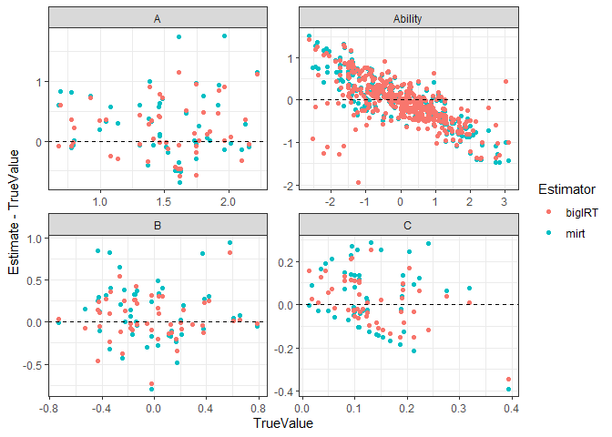
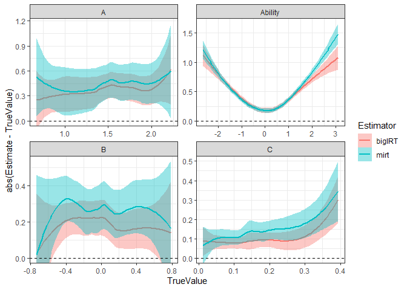
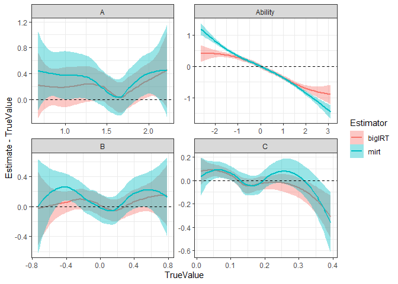

bigIRT
================
Charles Driver

<!-- badges: start -->
[](https://github.com/cdriveraus/bigIRT/actions/workflows/R-CMD-check.yaml)
<!-- badges: end -->

## Install

If building on windows, first ensure you have Rtools installed.
<https://cran.r-project.org/bin/windows/Rtools/>

Run the following code to install the package:

``` r
remotes::install_github('cdriveraus/bigIRT', INSTALL_opts = "--no-multiarch", dependencies = c("Depends", "Imports"))
```

## Example

This example generates data from a 3 parameter logistic model, fits the
model using mirt and bigIRT, and compares the parameter estimates.

``` r
library(bigIRT)
```

    ## Loading required package: data.table

``` r
library(data.table)
library(mirt)
```

    ## Loading required package: stats4

    ## Loading required package: lattice

``` r
library(ggplot2)

#generate data
dat <- simIRT(Nsubs = 1000,Nitems = 50,Nscales = 1,
  logitCMean = -2,logitCSD = 1,AMean = 1,ASD = .3,
  BMean=0,BSD = .5,
  AbilityMean = 0,AbilitySD = 1)

#normalise true parameters and store
trueitempars <- normaliseIRT(B = dat$B, A = dat$A, Ability = dat$Ability)

#convert to wide for mirt
wdat <- data.frame(dcast(data.table(dat$dat),formula = 'id ~ Item',value.var='score')[,-1])


#fit using mirt
mirtfit <- mirt(wdat,model=1, itemtype = '3PL',method = "EM")
```

    ## EM cycles terminated after 500 iterations.

``` r
#get normalized parameter estimates
mirtItempars <- coef(mirtfit)
mirtItempars$GroupPars <- NULL
mirtItempars <- rbindlist(lapply(mirtItempars, function(x) as.data.frame(x)))
mirtPersonpars <- fscores(mirtfit)[,1]
mirtpars<- normaliseIRT(B = -mirtItempars$d / mirtItempars$a1, A = mirtItempars$a1, Ability = mirtPersonpars)

#fit using bigIRT
bigirtfit <- fitIRT(dat$dat, pl=3, cores=4, dropPerfectScores = FALSE, stochastic=TRUE,
  score = 'score', id = 'id', scale = 'Scale', item = 'Item')
```

    ## Free estimation step...

    ## Progress est. = 0%, LPchange = 96, Iter = 31, LP = -31881.183848043Progress est. = 0%, LPchange = 120, Iter = 32, LP = -30989.9833787027Progress est. = 0%, LPchange = 140, Iter = 33, LP = -30315.1728567025Progress est. = 0.15%, LPchange = 140, Iter = 34, LP = -30315.1728567025Progress est. = 0%, LPchange = 160, Iter = 35, LP = -29758.8949673376Progress est. = 0.07%, LPchange = 160, Iter = 36, LP = -29741.7023523809Progress est. = 0.17%, LPchange = 150, Iter = 37, LP = -29741.7023523809Progress est. = 0%, LPchange = 160, Iter = 38, LP = -29540.1019415843Progress est. = 0.08%, LPchange = 160, Iter = 39, LP = -29540.1019415843Progress est. = 0%, LPchange = 160, Iter = 40, LP = -29364.731277841Progress est. = 0.08%, LPchange = 160, Iter = 41, LP = -29364.731277841Progress est. = 0%, LPchange = 160, Iter = 42, LP = -29282.2030974931Progress est. = 0.05%, LPchange = 160, Iter = 43, LP = -29271.1779731264Progress est. = 0.12%, LPchange = 160, Iter = 44, LP = -29271.1779731264Progress est. = 0%, LPchange = 160, Iter = 45, LP = -29167.404110647Progress est. = 0.07%, LPchange = 160, Iter = 46, LP = -29167.404110647Progress est. = 0.05%, LPchange = 160, Iter = 47, LP = -29125.2752185988Progress est. = 0.12%, LPchange = 160, Iter = 48, LP = -29125.2752185988Progress est. = 0.07%, LPchange = 160, Iter = 49, LP = -29067.189532407Progress est. = 0.14%, LPchange = 160, Iter = 50, LP = -29067.189532407Progress est. = 0.15%, LPchange = 160, Iter = 51, LP = -29042.7679410761Progress est. = 0.25%, LPchange = 160, Iter = 52, LP = -29042.7679410761Progress est. = 0.35%, LPchange = 160, Iter = 53, LP = -29019.2466671163Progress est. = 0.56%, LPchange = 150, Iter = 54, LP = -29019.2466671163Progress est. = 0.86%, LPchange = 150, Iter = 55, LP = -29005.8311343831Progress est. = 1.33%, LPchange = 140, Iter = 56, LP = -29005.8311343831Progress est. = 1.98%, LPchange = 130, Iter = 57, LP = -28992.514047427Progress est. = 2.88%, LPchange = 120, Iter = 58, LP = -28992.514047427Progress est. = 3.86%, LPchange = 110, Iter = 59, LP = -28982.45257715Progress est. = 4.54%, LPchange = 100, Iter = 60, LP = -28982.45257715Progress est. = 5.01%, LPchange = 97, Iter = 61, LP = -28975.9851289883Progress est. = 8.53%, LPchange = 67, Iter = 62, LP = -28975.9851289883Progress est. = 12.42%, LPchange = 45, Iter = 63, LP = -28970.4040254059Progress est. = 12.42%, LPchange = 45, Iter = 64, LP = -28970.4040254059Progress est. = 17.55%, LPchange = 26, Iter = 65, LP = -28969.8312804693Progress est. = 17.76%, LPchange = 26, Iter = 66, LP = -28969.8312804693Progress est. = 17.74%, LPchange = 26, Iter = 67, LP = -28967.8026396441Progress est. = 20.64%, LPchange = 19, Iter = 68, LP = -28967.8026396441Progress est. = 20.58%, LPchange = 19, Iter = 69, LP = -28964.2404741661Progress est. = 24.08%, LPchange = 13, Iter = 70, LP = -28964.2404741661Progress est. = 24.01%, LPchange = 13, Iter = 71, LP = -28961.4045710163Progress est. = 26.21%, LPchange = 11, Iter = 72, LP = -28961.4045710163Progress est. = 26.53%, LPchange = 10, Iter = 73, LP = -28960.8663423145Progress est. = 26.53%, LPchange = 10, Iter = 74, LP = -28960.8663423145Progress est. = 30.27%, LPchange = 7, Iter = 75, LP = -28957.0685646598Progress est. = 30.27%, LPchange = 7, Iter = 76, LP = -28957.0685646598Progress est. = 32.31%, LPchange = 5.7, Iter = 77, LP = -28955.067960893Progress est. = 32.31%, LPchange = 5.7, Iter = 78, LP = -28955.067960893Progress est. = 36.26%, LPchange = 3.8, Iter = 79, LP = -28954.2453771907Progress est. = 36.26%, LPchange = 3.8, Iter = 80, LP = -28954.2453771907Progress est. = 38.49%, LPchange = 3, Iter = 81, LP = -28953.1914520241Progress est. = 38.49%, LPchange = 3, Iter = 82, LP = -28953.1914520241Progress est. = 41.35%, LPchange = 2.2, Iter = 83, LP = -28952.6949215916Progress est. = 41.35%, LPchange = 2.2, Iter = 84, LP = -28952.6949215916Progress est. = 43.4%, LPchange = 1.8, Iter = 85, LP = -28952.0919978326Progress est. = 43.4%, LPchange = 1.8, Iter = 86, LP = -28952.0919978326Progress est. = 45.86%, LPchange = 1.4, Iter = 87, LP = -28950.8835694868Progress est. = 45.86%, LPchange = 1.4, Iter = 88, LP = -28950.8835694868Progress est. = 48.44%, LPchange = 1.1, Iter = 89, LP = -28950.6164306822Progress est. = 48.44%, LPchange = 1.1, Iter = 90, LP = -28950.6164306822Progress est. = 50.13%, LPchange = 0.89, Iter = 91, LP = -28949.2621311744Progress est. = 50.13%, LPchange = 0.89, Iter = 92, LP = -28949.2621311744Progress est. = 52.29%, LPchange = 0.71, Iter = 93, LP = -28949.0684669031Progress est. = 52.29%, LPchange = 0.71, Iter = 94, LP = -28949.0684669031Progress est. = 52.27%, LPchange = 0.71, Iter = 95, LP = -28948.4442742876Progress est. = 52.27%, LPchange = 0.71, Iter = 96, LP = -28948.4442742876Progress est. = 53.04%, LPchange = 0.66, Iter = 97, LP = -28948.0518640552Progress est. = 53.04%, LPchange = 0.66, Iter = 98, LP = -28948.0518640552Progress est. = 54.73%, LPchange = 0.55, Iter = 99, LP = -28947.685346405Progress est. = 54.73%, LPchange = 0.55, Iter = 100, LP = -28947.685346405Progress est. = 56.54%, LPchange = 0.46, Iter = 101, LP = -28947.685346405Progress est. = 56.39%, LPchange = 0.46, Iter = 102, LP = -28947.4699300992Progress est. = 56.73%, LPchange = 0.45, Iter = 103, LP = -28947.4109751839Progress est. = 56.73%, LPchange = 0.45, Iter = 104, LP = -28947.4109751839Progress est. = 59.37%, LPchange = 0.34, Iter = 105, LP = -28946.8404582483Progress est. = 59.33%, LPchange = 0.34, Iter = 106, LP = -28946.8039024152Progress est. = 61.29%, LPchange = 0.28, Iter = 107, LP = -28946.6906223235Progress est. = 61.29%, LPchange = 0.28, Iter = 108, LP = -28946.6906223235Progress est. = 61.82%, LPchange = 0.26, Iter = 109, LP = -28946.3188242225Progress est. = 61.8%, LPchange = 0.26, Iter = 110, LP = -28946.3027848838Progress est. = 62.63%, LPchange = 0.24, Iter = 111, LP = -28945.9000603619Progress est. = 62.63%, LPchange = 0.24, Iter = 112, LP = -28945.9000603619Progress est. = 63.3%, LPchange = 0.23, Iter = 113, LP = -28945.9000603619Progress est. = 63.19%, LPchange = 0.23, Iter = 114, LP = -28945.8207003791Progress est. = 64.08%, LPchange = 0.21, Iter = 115, LP = -28945.8207003791Progress est. = 63.4%, LPchange = 0.22, Iter = 116, LP = -28945.3618547292Progress est. = 65.3%, LPchange = 0.18, Iter = 117, LP = -28945.3618547292Progress est. = 64.03%, LPchange = 0.21, Iter = 118, LP = -28944.5789290077Progress est. = 64.44%, LPchange = 0.2, Iter = 119, LP = -28944.5789290077Progress est. = 63.3%, LPchange = 0.23, Iter = 120, LP = -28943.8192168316Progress est. = 65.44%, LPchange = 0.18, Iter = 121, LP = -28943.8192168316Progress est. = 64.3%, LPchange = 0.2, Iter = 122, LP = -28943.1354249754Progress est. = 64.61%, LPchange = 0.2, Iter = 123, LP = -28943.1354249754Progress est. = 62.52%, LPchange = 0.25, Iter = 124, LP = -28941.6958772409Progress est. = 63.37%, LPchange = 0.22, Iter = 125, LP = -28941.6958772409Progress est. = 61.02%, LPchange = 0.29, Iter = 126, LP = -28939.8283147545Progress est. = 61.47%, LPchange = 0.27, Iter = 127, LP = -28939.8283147545Progress est. = 59.75%, LPchange = 0.33, Iter = 128, LP = -28938.2257491559Progress est. = 60.12%, LPchange = 0.32, Iter = 129, LP = -28938.2257491559Progress est. = 59.43%, LPchange = 0.34, Iter = 130, LP = -28937.5268518013Progress est. = 58.72%, LPchange = 0.36, Iter = 131, LP = -28936.7485062605Progress est. = 58.92%, LPchange = 0.36, Iter = 132, LP = -28936.7485062605Progress est. = 58.28%, LPchange = 0.38, Iter = 133, LP = -28935.9516154424Progress est. = 58.16%, LPchange = 0.39, Iter = 134, LP = -28935.8100837686Progress est. = 58.17%, LPchange = 0.39, Iter = 135, LP = -28935.2595161092Progress est. = 57.83%, LPchange = 0.4, Iter = 136, LP = -28934.8020477989Progress est. = 57.75%, LPchange = 0.4, Iter = 137, LP = -28934.5849597471Progress est. = 57.52%, LPchange = 0.41, Iter = 138, LP = -28934.2899134252Progress est. = 57.4%, LPchange = 0.42, Iter = 139, LP = -28933.7724121584Progress est. = 57.32%, LPchange = 0.42, Iter = 140, LP = -28933.6530269976Progress est. = 57.36%, LPchange = 0.42, Iter = 141, LP = -28933.3020278109Progress est. = 56.98%, LPchange = 0.44, Iter = 142, LP = -28932.795121071Progress est. = 56.89%, LPchange = 0.44, Iter = 143, LP = -28932.664859981Progress est. = 56.6%, LPchange = 0.45, Iter = 144, LP = -28932.181230873Progress est. = 56.44%, LPchange = 0.46, Iter = 145, LP = -28931.9535752563Progress est. = 56.46%, LPchange = 0.46, Iter = 146, LP = -28931.5203962935Progress est. = 56.17%, LPchange = 0.48, Iter = 147, LP = -28931.1014560262Progress est. = 56.67%, LPchange = 0.45, Iter = 148, LP = -28931.0336445755Progress est. = 56.51%, LPchange = 0.46, Iter = 149, LP = -28930.8087410397Progress est. = 57%, LPchange = 0.44, Iter = 150, LP = -28930.7340342276Progress est. = 56.37%, LPchange = 0.47, Iter = 151, LP = -28929.8485621478Progress est. = 56.32%, LPchange = 0.47, Iter = 152, LP = -28929.1000140303Progress est. = 56.32%, LPchange = 0.47, Iter = 153, LP = -28929.1000140303Progress est. = 57.01%, LPchange = 0.44, Iter = 154, LP = -28928.6238941825Progress est. = 57.01%, LPchange = 0.44, Iter = 155, LP = -28928.6238941825Progress est. = 57.93%, LPchange = 0.4, Iter = 156, LP = -28927.9503713177Progress est. = 57.93%, LPchange = 0.4, Iter = 157, LP = -28927.9503713177Progress est. = 59.25%, LPchange = 0.35, Iter = 158, LP = -28927.8664724846Progress est. = 58.66%, LPchange = 0.37, Iter = 159, LP = -28927.2119747574Progress est. = 58.84%, LPchange = 0.36, Iter = 160, LP = -28926.7188699041Progress est. = 58.77%, LPchange = 0.36, Iter = 161, LP = -28925.8628408302Progress est. = 58.4%, LPchange = 0.38, Iter = 162, LP = -28925.4387203277Progress est. = 58.71%, LPchange = 0.37, Iter = 163, LP = -28924.9988512583Progress est. = 58.38%, LPchange = 0.38, Iter = 164, LP = -28924.4704831714Progress est. = 58.31%, LPchange = 0.38, Iter = 165, LP = -28923.8362586693Progress est. = 58.52%, LPchange = 0.37, Iter = 166, LP = -28923.633297779Progress est. = 58.31%, LPchange = 0.38, Iter = 167, LP = -28923.1718189851Progress est. = 58.23%, LPchange = 0.38, Iter = 168, LP = -28922.7755633244Progress est. = 58.38%, LPchange = 0.38, Iter = 169, LP = -28922.4367577876Progress est. = 58.24%, LPchange = 0.38, Iter = 170, LP = -28922.1536817172Progress est. = 58.26%, LPchange = 0.38, Iter = 171, LP = -28921.8223411671Progress est. = 58.48%, LPchange = 0.37, Iter = 172, LP = -28921.5743037074Progress est. = 58.36%, LPchange = 0.38, Iter = 173, LP = -28921.3103253033Progress est. = 58.52%, LPchange = 0.37, Iter = 174, LP = -28921.0073008899Progress est. = 58.5%, LPchange = 0.37, Iter = 175, LP = -28920.7598231573Progress est. = 58.69%, LPchange = 0.37, Iter = 176, LP = -28920.5469887493Progress est. = 58.81%, LPchange = 0.36, Iter = 177, LP = -28920.2657072933Progress est. = 58.68%, LPchange = 0.37, Iter = 178, LP = -28920.0469825412Progress est. = 58.74%, LPchange = 0.36, Iter = 179, LP = -28919.8895480458Progress est. = 58.81%, LPchange = 0.36, Iter = 180, LP = -28919.8895480458Progress est. = 59.63%, LPchange = 0.33, Iter = 181, LP = -28919.8895480458Progress est. = 60.38%, LPchange = 0.31, Iter = 182, LP = -28919.8895480458Progress est. = 60.17%, LPchange = 0.31, Iter = 183, LP = -28919.6883852369Progress est. = 60.16%, LPchange = 0.31, Iter = 184, LP = -28919.2028816212Progress est. = 60.16%, LPchange = 0.31, Iter = 185, LP = -28919.2028816212Progress est. = 60.87%, LPchange = 0.29, Iter = 186, LP = -28919.2028816212Progress est. = 60.41%, LPchange = 0.31, Iter = 187, LP = -28918.7741768181Progress est. = 60.46%, LPchange = 0.3, Iter = 188, LP = -28918.7387203504Progress est. = 60.86%, LPchange = 0.29, Iter = 189, LP = -28918.4505081283Progress est. = 61.27%, LPchange = 0.28, Iter = 190, LP = -28918.3236001957Progress est. = 62.03%, LPchange = 0.26, Iter = 191, LP = -28918.1058073992Progress est. = 62.51%, LPchange = 0.25, Iter = 192, LP = -28918.0570317659Progress est. = 62.89%, LPchange = 0.24, Iter = 193, LP = -28917.9049684733Progress est. = 63.49%, LPchange = 0.22, Iter = 194, LP = -28917.8037214146Progress est. = 64.35%, LPchange = 0.2, Iter = 195, LP = -28917.7406046653Progress est. = 64.52%, LPchange = 0.2, Iter = 196, LP = -28917.6434591612Progress est. = 65.1%, LPchange = 0.19, Iter = 197, LP = -28917.5350478169Progress est. = 65.67%, LPchange = 0.18, Iter = 198, LP = -28917.4608338844Progress est. = 66.2%, LPchange = 0.17, Iter = 199, LP = -28917.4059806943Progress est. = 66.55%, LPchange = 0.16, Iter = 200, LP = -28917.3029514232Progress est. = 67.15%, LPchange = 0.15, Iter = 201, LP = -28917.2654708159Progress est. = 67.54%, LPchange = 0.15, Iter = 202, LP = -28917.2004127303Progress est. = 67.96%, LPchange = 0.14, Iter = 203, LP = -28917.1212326491Progress est. = 68.56%, LPchange = 0.13, Iter = 204, LP = -28917.0700207521Progress est. = 69.14%, LPchange = 0.12, Iter = 205, LP = -28917.0529493555Progress est. = 69.47%, LPchange = 0.12, Iter = 206, LP = -28916.9672329827Progress est. = 70.08%, LPchange = 0.11, Iter = 207, LP = -28916.9063531024Progress est. = 70.6%, LPchange = 0.11, Iter = 208, LP = -28916.8639995257Progress est. = 70.84%, LPchange = 0.1, Iter = 209, LP = -28916.7844885762Progress est. = 70.64%, LPchange = 0.11, Iter = 210, LP = -28916.7183173174Progress est. = 70.45%, LPchange = 0.11, Iter = 211, LP = -28916.6571189945Progress est. = 70.32%, LPchange = 0.11, Iter = 212, LP = -28916.6134571183Progress est. = 70.79%, LPchange = 0.1, Iter = 213, LP = -28916.5653876638Progress est. = 72.18%, LPchange = 0.09, Iter = 214, LP = -28916.5021541044Progress est. = 72.03%, LPchange = 0.092, Iter = 215, LP = -28916.4576663505Progress est. = 71.85%, LPchange = 0.093, Iter = 216, LP = -28916.4077440467Progress est. = 73.28%, LPchange = 0.08, Iter = 217, LP = -28916.3632722288Progress est. = 73.19%, LPchange = 0.081, Iter = 218, LP = -28916.3056911788Progress est. = 74.4%, LPchange = 0.071, Iter = 219, LP = -28916.3056911788Progress est. = 74.93%, LPchange = 0.068, Iter = 220, LP = -28916.2931030741Progress est. = 75.44%, LPchange = 0.064, Iter = 221, LP = -28916.1801901689Progress est. = 75.38%, LPchange = 0.065, Iter = 222, LP = -28916.1196856195Progress est. = 75.98%, LPchange = 0.061, Iter = 223, LP = -28916.0838567065Progress est. = 76.35%, LPchange = 0.058, Iter = 224, LP = -28916.0527835473Progress est. = 76.24%, LPchange = 0.059, Iter = 225, LP = -28915.969318866Progress est. = 76.59%, LPchange = 0.057, Iter = 226, LP = -28915.9347847458Progress est. = 77.22%, LPchange = 0.053, Iter = 227, LP = -28915.9347847458Progress est. = 76.97%, LPchange = 0.055, Iter = 228, LP = -28915.81792386Progress est. = 77.19%, LPchange = 0.054, Iter = 229, LP = -28915.8008011419Progress est. = 77.29%, LPchange = 0.053, Iter = 230, LP = -28915.7151493511Progress est. = 77.52%, LPchange = 0.052, Iter = 231, LP = -28915.7151493511Progress est. = 77.77%, LPchange = 0.05, Iter = 232, LP = -28915.6895034644Progress est. = 78.1%, LPchange = 0.049, Iter = 233, LP = -28915.6609702862Progress est. = 78.2%, LPchange = 0.048, Iter = 234, LP = -28915.6243054875Progress est. = 78.13%, LPchange = 0.049, Iter = 235, LP = -28915.5967315976Progress est. = 78.35%, LPchange = 0.047, Iter = 236, LP = -28915.5438662636Progress est. = 78.6%, LPchange = 0.046, Iter = 237, LP = -28915.5199515292Progress est. = 78.66%, LPchange = 0.046, Iter = 238, LP = -28915.4857740791Progress est. = 79.04%, LPchange = 0.044, Iter = 239, LP = -28915.4594247337Progress est. = 79.38%, LPchange = 0.043, Iter = 240, LP = -28915.4404355601Progress est. = 79.63%, LPchange = 0.042, Iter = 241, LP = -28915.4113466016Progress est. = 79.84%, LPchange = 0.041, Iter = 242, LP = -28915.3950055179Progress est. = 80.01%, LPchange = 0.04, Iter = 243, LP = -28915.3674987159Progress est. = 80.4%, LPchange = 0.038, Iter = 244, LP = -28915.3520246885Progress est. = 80.55%, LPchange = 0.038, Iter = 245, LP = -28915.3261270956Progress est. = 80.86%, LPchange = 0.037, Iter = 246, LP = -28915.3115795559Progress est. = 81.05%, LPchange = 0.036, Iter = 247, LP = -28915.2885553468Progress est. = 81.4%, LPchange = 0.035, Iter = 248, LP = -28915.2694477245Progress est. = 81.4%, LPchange = 0.035, Iter = 249, LP = -28915.2694477245Progress est. = 81.52%, LPchange = 0.034, Iter = 250, LP = -28915.2694477245Progress est. = 82.43%, LPchange = 0.031, Iter = 251, LP = -28915.2494377984Progress est. = 83.08%, LPchange = 0.029, Iter = 252, LP = -28915.2494377984Progress est. = 83.43%, LPchange = 0.028, Iter = 253, LP = -28915.2445221812Progress est. = 83.5%, LPchange = 0.028, Iter = 254, LP = -28915.2194589343Progress est. = 84.42%, LPchange = 0.025, Iter = 255, LP = -28915.2122095364Progress est. = 84.52%, LPchange = 0.025, Iter = 256, LP = -28915.1850214512Progress est. = 84.33%, LPchange = 0.025, Iter = 257, LP = -28915.170277358Progress est. = 85.82%, LPchange = 0.022, Iter = 258, LP = -28915.1630059837Progress est. = 85.83%, LPchange = 0.022, Iter = 259, LP = -28915.1466377129Progress est. = 87.04%, LPchange = 0.019, Iter = 260, LP = -28915.1381780003Progress est. = 86.81%, LPchange = 0.02, Iter = 261, LP = -28915.1247022068Progress est. = 87.1%, LPchange = 0.019, Iter = 262, LP = -28915.1166256806Progress est. = 87.47%, LPchange = 0.018, Iter = 263, LP = -28915.1096820283Progress est. = 87.85%, LPchange = 0.018, Iter = 264, LP = -28915.0942644383Progress est. = 88.2%, LPchange = 0.017, Iter = 265, LP = -28915.0852445227Progress est. = 89.09%, LPchange = 0.016, Iter = 266, LP = -28915.0775979615Progress est. = 89.55%, LPchange = 0.015, Iter = 267, LP = -28915.0755865146Progress est. = 90.06%, LPchange = 0.014, Iter = 268, LP = -28915.0641984226Progress est. = 90.44%, LPchange = 0.013, Iter = 269, LP = -28915.05450836Progress est. = 90.8%, LPchange = 0.013, Iter = 270, LP = -28915.0501702976Progress est. = 91.54%, LPchange = 0.012, Iter = 271, LP = -28915.0501702976Progress est. = 91.99%, LPchange = 0.011, Iter = 272, LP = -28915.0501702976Progress est. = 92.79%, LPchange = 0.011, Iter = 273, LP = -28915.0501702976Progress est. = 92.91%, LPchange = 0.01, Iter = 274, LP = -28915.0387920581Progress est. = 93.68%, LPchange = 0.0096, Iter = 275, LP = -28915.0369256734Progress est. = 93.71%, LPchange = 0.0096, Iter = 276, LP = -28915.0231089041Progress est. = 94.25%, LPchange = 0.0091, Iter = 277, LP = -28915.0159254562Progress est. = 94.79%, LPchange = 0.0086, Iter = 278, LP = -28915.0116616446Progress est. = 94.56%, LPchange = 0.0088, Iter = 279, LP = -28915.0054430346Progress est. = 94.38%, LPchange = 0.009, Iter = 280, LP = -28915.0004861775Progress est. = 94.96%, LPchange = 0.0084, Iter = 281, LP = -28914.996214417Progress est. = 94.83%, LPchange = 0.0086, Iter = 282, LP = -28914.9927473509Progress est. = 94.89%, LPchange = 0.0085, Iter = 283, LP = -28914.9895228775Progress est. = 95.74%, LPchange = 0.0078, Iter = 284, LP = -28914.986040929Progress est. = 95.93%, LPchange = 0.0076, Iter = 285, LP = -28914.9832666893Progress est. = 97.06%, LPchange = 0.0068, Iter = 286, LP = -28914.9814370904Progress est. = 97.66%, LPchange = 0.0064, Iter = 287, LP = -28914.9790448186Progress est. = 97.97%, LPchange = 0.0062, Iter = 288, LP = -28914.9777721629Progress est. = 98.86%, LPchange = 0.0056, Iter = 289, LP = -28914.9777721629Progress est. = 99.35%, LPchange = 0.0053, Iter = 290, LP = -28914.9777721629Progress est. = 100%, LPchange = 0.0049, Iter = 291, LP = -28914.9777721629
    ## Converged -- lp change within tol(0.005)
    ## Empirical Bayes step...
    ## Progress est. = 0%, LPchange = 86, Iter = 31, LP = -32123.826767118Progress est. = 0%, LPchange = 110, Iter = 32, LP = -31332.3812540841Progress est. = 0%, LPchange = 140, Iter = 33, LP = -30331.4805795993Progress est. = 0.13%, LPchange = 140, Iter = 34, LP = -30331.4805795993Progress est. = 0%, LPchange = 140, Iter = 35, LP = -30177.6408870137Progress est. = 0.1%, LPchange = 140, Iter = 36, LP = -30177.6408870137Progress est. = 0%, LPchange = 140, Iter = 37, LP = -29965.8417245009Progress est. = 0.08%, LPchange = 140, Iter = 38, LP = -29965.8417245009Progress est. = 0.02%, LPchange = 140, Iter = 39, LP = -29890.9174012707Progress est. = 0.1%, LPchange = 140, Iter = 40, LP = -29890.9174012707Progress est. = 0%, LPchange = 150, Iter = 41, LP = -29684.7901678799Progress est. = 0.07%, LPchange = 150, Iter = 42, LP = -29684.7901678799Progress est. = 0%, LPchange = 150, Iter = 43, LP = -29548.4621545618Progress est. = 0.06%, LPchange = 150, Iter = 44, LP = -29548.4621545618Progress est. = 0%, LPchange = 150, Iter = 45, LP = -29467.1241605572Progress est. = 0.06%, LPchange = 150, Iter = 46, LP = -29467.1241605572Progress est. = 0.02%, LPchange = 150, Iter = 47, LP = -29406.2118255273Progress est. = 0.08%, LPchange = 150, Iter = 48, LP = -29406.2118255273Progress est. = 0.07%, LPchange = 150, Iter = 49, LP = -29370.7511833959Progress est. = 0.13%, LPchange = 150, Iter = 50, LP = -29370.7511833959Progress est. = 0.11%, LPchange = 150, Iter = 51, LP = -29325.2426426557Progress est. = 0.2%, LPchange = 150, Iter = 52, LP = -29325.2426426557Progress est. = 0.25%, LPchange = 150, Iter = 53, LP = -29282.5212426137Progress est. = 0.45%, LPchange = 140, Iter = 54, LP = -29282.5212426137Progress est. = 0.7%, LPchange = 140, Iter = 55, LP = -29259.5288526293Progress est. = 1.13%, LPchange = 130, Iter = 56, LP = -29259.5288526293Progress est. = 1.66%, LPchange = 120, Iter = 57, LP = -29221.2962544466Progress est. = 2.45%, LPchange = 110, Iter = 58, LP = -29221.2962544466Progress est. = 3.17%, LPchange = 100, Iter = 59, LP = -29201.8853365323Progress est. = 3.41%, LPchange = 98, Iter = 60, LP = -29201.8853365323Progress est. = 3.4%, LPchange = 98, Iter = 61, LP = -29184.8649625834Progress est. = 5.88%, LPchange = 72, Iter = 62, LP = -29184.8649625834Progress est. = 10.72%, LPchange = 39, Iter = 63, LP = -29164.3317549016Progress est. = 10.7%, LPchange = 39, Iter = 64, LP = -29161.6333097946Progress est. = 11.77%, LPchange = 34, Iter = 65, LP = -29156.0700863159Progress est. = 11.68%, LPchange = 34, Iter = 66, LP = -29143.5756485601Progress est. = 13.4%, LPchange = 28, Iter = 67, LP = -29133.758492946Progress est. = 13.36%, LPchange = 28, Iter = 68, LP = -29129.5737940532Progress est. = 13.99%, LPchange = 26, Iter = 69, LP = -29118.4315085524Progress est. = 13.97%, LPchange = 26, Iter = 70, LP = -29116.8368704746Progress est. = 16.31%, LPchange = 19, Iter = 71, LP = -29108.5459496927Progress est. = 16.18%, LPchange = 20, Iter = 72, LP = -29098.6248307068Progress est. = 18.18%, LPchange = 15, Iter = 73, LP = -29093.121714257Progress est. = 18.18%, LPchange = 15, Iter = 74, LP = -29093.121714257Progress est. = 19.36%, LPchange = 13, Iter = 75, LP = -29074.654974731Progress est. = 19.36%, LPchange = 13, Iter = 76, LP = -29074.654974731Progress est. = 20.43%, LPchange = 11, Iter = 77, LP = -29063.4414285943Progress est. = 20.43%, LPchange = 11, Iter = 78, LP = -29063.4414285943Progress est. = 21.12%, LPchange = 10, Iter = 79, LP = -29056.4001743322Progress est. = 21.12%, LPchange = 10, Iter = 80, LP = -29056.4001743322Progress est. = 22.12%, LPchange = 9.2, Iter = 81, LP = -29048.2397922963Progress est. = 22.12%, LPchange = 9.2, Iter = 82, LP = -29048.2397922963Progress est. = 23.22%, LPchange = 8, Iter = 83, LP = -29041.3083204685Progress est. = 23.22%, LPchange = 8, Iter = 84, LP = -29041.3083204685Progress est. = 23.9%, LPchange = 7.4, Iter = 85, LP = -29038.2472940561Progress est. = 23.9%, LPchange = 7.4, Iter = 86, LP = -29038.1236520476Progress est. = 25.23%, LPchange = 6.2, Iter = 87, LP = -29034.0912973555Progress est. = 25.18%, LPchange = 6.3, Iter = 88, LP = -29032.9399038569Progress est. = 25.94%, LPchange = 5.7, Iter = 89, LP = -29030.8134643813Progress est. = 25.83%, LPchange = 5.8, Iter = 90, LP = -29028.4436416755Progress est. = 26.64%, LPchange = 5.2, Iter = 91, LP = -29028.174982535Progress est. = 26.57%, LPchange = 5.3, Iter = 92, LP = -29026.8315486964Progress est. = 27.59%, LPchange = 4.6, Iter = 93, LP = -29025.3351856527Progress est. = 27.72%, LPchange = 4.6, Iter = 94, LP = -29024.8811437858Progress est. = 28.05%, LPchange = 4.4, Iter = 95, LP = -29024.8811437858Progress est. = 28.75%, LPchange = 4, Iter = 96, LP = -29023.569978089Progress est. = 29.43%, LPchange = 3.7, Iter = 97, LP = -29023.569978089Progress est. = 29.74%, LPchange = 3.5, Iter = 98, LP = -29023.569978089Progress est. = 30.55%, LPchange = 3.2, Iter = 99, LP = -29022.7482353549Progress est. = 30.66%, LPchange = 3.1, Iter = 100, LP = -29022.5451488353Progress est. = 31.38%, LPchange = 2.9, Iter = 101, LP = -29022.3619101638Progress est. = 32.3%, LPchange = 2.6, Iter = 102, LP = -29021.9599780928Progress est. = 32.89%, LPchange = 2.4, Iter = 103, LP = -29021.9369051458Progress est. = 32.85%, LPchange = 2.4, Iter = 104, LP = -29021.5441584258Progress est. = 35.18%, LPchange = 1.8, Iter = 105, LP = -29021.2800396299Progress est. = 35.15%, LPchange = 1.8, Iter = 106, LP = -29021.1068901633Progress est. = 36.99%, LPchange = 1.4, Iter = 107, LP = -29020.9971154541Progress est. = 36.97%, LPchange = 1.4, Iter = 108, LP = -29020.8759802369Progress est. = 38.37%, LPchange = 1.2, Iter = 109, LP = -29020.731267989Progress est. = 38.34%, LPchange = 1.2, Iter = 110, LP = -29020.600428225Progress est. = 40.36%, LPchange = 0.93, Iter = 111, LP = -29020.4867027517Progress est. = 40.34%, LPchange = 0.93, Iter = 112, LP = -29020.4155396148Progress est. = 42.58%, LPchange = 0.7, Iter = 113, LP = -29020.3410489487Progress est. = 42.55%, LPchange = 0.7, Iter = 114, LP = -29020.2552523506Progress est. = 43.78%, LPchange = 0.6, Iter = 115, LP = -29020.2188582733Progress est. = 43.83%, LPchange = 0.6, Iter = 116, LP = -29020.2010420232Progress est. = 45.85%, LPchange = 0.46, Iter = 117, LP = -29020.2010420232Progress est. = 46.53%, LPchange = 0.42, Iter = 118, LP = -29020.2010420232Progress est. = 47.98%, LPchange = 0.35, Iter = 119, LP = -29020.2010420232Progress est. = 49.98%, LPchange = 0.27, Iter = 120, LP = -29020.2010420232Progress est. = 50.15%, LPchange = 0.27, Iter = 121, LP = -29020.1072986246Progress est. = 51.6%, LPchange = 0.22, Iter = 122, LP = -29020.1072986246Progress est. = 53.59%, LPchange = 0.17, Iter = 123, LP = -29020.1072986246Progress est. = 54%, LPchange = 0.17, Iter = 124, LP = -29019.913604736Progress est. = 54%, LPchange = 0.17, Iter = 125, LP = -29019.913604736Progress est. = 56.16%, LPchange = 0.13, Iter = 126, LP = -29019.7860699052Progress est. = 56.16%, LPchange = 0.13, Iter = 127, LP = -29019.7860699052Progress est. = 55.94%, LPchange = 0.13, Iter = 128, LP = -29019.6833001257Progress est. = 57.83%, LPchange = 0.1, Iter = 129, LP = -29019.6833001257Progress est. = 58.09%, LPchange = 0.099, Iter = 130, LP = -29019.5814828205Progress est. = 58.6%, LPchange = 0.093, Iter = 131, LP = -29019.5814828205Progress est. = 59.65%, LPchange = 0.081, Iter = 132, LP = -29019.5245687246Progress est. = 59.61%, LPchange = 0.082, Iter = 133, LP = -29019.4905823947Progress est. = 60.92%, LPchange = 0.069, Iter = 134, LP = -29019.4705997676Progress est. = 61.84%, LPchange = 0.062, Iter = 135, LP = -29019.4329138561Progress est. = 62.4%, LPchange = 0.057, Iter = 136, LP = -29019.3843904539Progress est. = 62.75%, LPchange = 0.055, Iter = 137, LP = -29019.3499000432Progress est. = 63.21%, LPchange = 0.052, Iter = 138, LP = -29019.322209426Progress est. = 63.82%, LPchange = 0.048, Iter = 139, LP = -29019.2929128789Progress est. = 64.43%, LPchange = 0.044, Iter = 140, LP = -29019.2684225285Progress est. = 64.99%, LPchange = 0.041, Iter = 141, LP = -29019.245059707Progress est. = 65.32%, LPchange = 0.04, Iter = 142, LP = -29019.2251042003Progress est. = 65.74%, LPchange = 0.038, Iter = 143, LP = -29019.210837731Progress est. = 66.29%, LPchange = 0.035, Iter = 144, LP = -29019.2016981171Progress est. = 66.52%, LPchange = 0.034, Iter = 145, LP = -29019.1955889129Progress est. = 66.65%, LPchange = 0.034, Iter = 146, LP = -29019.1945288245Progress est. = 66.65%, LPchange = 0.034, Iter = 147, LP = -29019.1945288245Progress est. = 66.65%, LPchange = 0.034, Iter = 148, LP = -29019.1945288245Progress est. = 66.54%, LPchange = 0.034, Iter = 149, LP = -29019.1803498298Progress est. = 66.47%, LPchange = 0.034, Iter = 150, LP = -29019.1714165663Progress est. = 67.22%, LPchange = 0.031, Iter = 151, LP = -29019.1698142355Progress est. = 67.22%, LPchange = 0.031, Iter = 152, LP = -29019.1698142355Progress est. = 67.22%, LPchange = 0.031, Iter = 153, LP = -29019.1698142355Progress est. = 69.05%, LPchange = 0.025, Iter = 154, LP = -29019.1698142355Progress est. = 68.86%, LPchange = 0.025, Iter = 155, LP = -29019.1518537764Progress est. = 70.25%, LPchange = 0.021, Iter = 156, LP = -29019.1468486089Progress est. = 70.25%, LPchange = 0.021, Iter = 157, LP = -29019.1468486089Progress est. = 71.64%, LPchange = 0.018, Iter = 158, LP = -29019.1468486089Progress est. = 71.58%, LPchange = 0.018, Iter = 159, LP = -29019.1427801695Progress est. = 73.06%, LPchange = 0.015, Iter = 160, LP = -29019.1329084462Progress est. = 73.05%, LPchange = 0.015, Iter = 161, LP = -29019.1323731569Progress est. = 73.99%, LPchange = 0.013, Iter = 162, LP = -29019.1255342734Progress est. = 74.62%, LPchange = 0.012, Iter = 163, LP = -29019.1222000896Progress est. = 74.95%, LPchange = 0.012, Iter = 164, LP = -29019.1172983951Progress est. = 75.76%, LPchange = 0.011, Iter = 165, LP = -29019.113825688Progress est. = 76.93%, LPchange = 0.0092, Iter = 166, LP = -29019.1089002814Progress est. = 77.86%, LPchange = 0.0082, Iter = 167, LP = -29019.1050456123Progress est. = 78.67%, LPchange = 0.0074, Iter = 168, LP = -29019.1010193292Progress est. = 79.6%, LPchange = 0.0066, Iter = 169, LP = -29019.0963692312Progress est. = 80.52%, LPchange = 0.0058, Iter = 170, LP = -29019.0932784205Progress est. = 81.65%, LPchange = 0.0051, Iter = 171, LP = -29019.0932784205Progress est. = 82.77%, LPchange = 0.0044, Iter = 172, LP = -29019.0932784205Progress est. = 83.68%, LPchange = 0.0039, Iter = 173, LP = -29019.0932784205Progress est. = 83.05%, LPchange = 0.0042, Iter = 174, LP = -29019.0743809382Progress est. = 83.44%, LPchange = 0.004, Iter = 175, LP = -29019.0743809382Progress est. = 83.51%, LPchange = 0.004, Iter = 176, LP = -29019.0743809382Progress est. = 83.12%, LPchange = 0.0042, Iter = 177, LP = -29019.0684084401Progress est. = 83.12%, LPchange = 0.0042, Iter = 178, LP = -29019.0684084401Progress est. = 83.33%, LPchange = 0.0041, Iter = 179, LP = -29019.0574594347Progress est. = 83.92%, LPchange = 0.0038, Iter = 180, LP = -29019.0574594347Progress est. = 83.44%, LPchange = 0.004, Iter = 181, LP = -29019.0487101441Progress est. = 83.3%, LPchange = 0.0041, Iter = 182, LP = -29019.0465112641Progress est. = 83.05%, LPchange = 0.0042, Iter = 183, LP = -29019.0425754932Progress est. = 82.7%, LPchange = 0.0044, Iter = 184, LP = -29019.0368126457Progress est. = 83.74%, LPchange = 0.0039, Iter = 185, LP = -29019.0351594868Progress est. = 84.04%, LPchange = 0.0037, Iter = 186, LP = -29019.0345330459Progress est. = 83.75%, LPchange = 0.0039, Iter = 187, LP = -29019.0303179449Progress est. = 83.65%, LPchange = 0.0039, Iter = 188, LP = -29019.0289460925Progress est. = 83.9%, LPchange = 0.0038, Iter = 189, LP = -29019.028424272Progress est. = 84.57%, LPchange = 0.0035, Iter = 190, LP = -29019.0278798078Progress est. = 84.53%, LPchange = 0.0035, Iter = 191, LP = -29019.0268202649Progress est. = 85%, LPchange = 0.0033, Iter = 192, LP = -29019.0260506062Progress est. = 85.27%, LPchange = 0.0032, Iter = 193, LP = -29019.0260506062Progress est. = 85.69%, LPchange = 0.003, Iter = 194, LP = -29019.0260506062Progress est. = 85.99%, LPchange = 0.0029, Iter = 195, LP = -29019.0260506062Progress est. = 86.45%, LPchange = 0.0028, Iter = 196, LP = -29019.0260506062Progress est. = 86.83%, LPchange = 0.0026, Iter = 197, LP = -29019.0260506062Progress est. = 87.24%, LPchange = 0.0025, Iter = 198, LP = -29019.0260506062Progress est. = 87.75%, LPchange = 0.0023, Iter = 199, LP = -29019.0260506062Progress est. = 88.11%, LPchange = 0.0022, Iter = 200, LP = -29019.0260506062Progress est. = 88.11%, LPchange = 0.0022, Iter = 201, LP = -29019.0260506062Progress est. = 88.11%, LPchange = 0.0022, Iter = 202, LP = -29019.0260506062Progress est. = 88.1%, LPchange = 0.0022, Iter = 203, LP = -29019.0259884974Progress est. = 90.71%, LPchange = 0.0016, Iter = 204, LP = -29019.0259884974Progress est. = 90.69%, LPchange = 0.0016, Iter = 205, LP = -29019.0258648474Progress est. = 90.65%, LPchange = 0.0016, Iter = 206, LP = -29019.0255917766Progress est. = 91.68%, LPchange = 0.0014, Iter = 207, LP = -29019.0255917766Progress est. = 91.68%, LPchange = 0.0014, Iter = 208, LP = -29019.0255917766Progress est. = 93.94%, LPchange = 0.0011, Iter = 209, LP = -29019.025231494Progress est. = 93.94%, LPchange = 0.0011, Iter = 210, LP = -29019.025231494Progress est. = 96.44%, LPchange = 0.00078, Iter = 211, LP = -29019.025201443Progress est. = 97.19%, LPchange = 0.00071, Iter = 212, LP = -29019.0251239136Progress est. = 98.8%, LPchange = 0.00058, Iter = 213, LP = -29019.0251239136Progress est. = 100%, LPchange = 0.00039, Iter = 214, LP = -29019.0250367109
    ## Converged -- lp change within tol(5e-04)

``` r
#get normalized parameter estimates
bigirtpars <- normaliseIRT(B = bigirtfit$itemPars$B, A = bigirtfit$itemPars$A, Ability = bigirtfit$pars$Ability)

#combine parameter outputs
itempars <- rbind(
  data.table(Estimator = 'mirt', Parameter = 'A', Estimate=c(mirtpars$A), TrueValue=c(trueitempars$A)),
  data.table(Estimator = 'mirt', Parameter = 'B', Estimate=c(mirtpars$B), TrueValue=c(trueitempars$B)),
  data.table(Estimator = 'mirt', Parameter = 'C', Estimate=c(mirtItempars$g), TrueValue=c(dat$C)),
  data.table(Estimator = 'bigIRT', Parameter = 'A', Estimate=c(bigirtpars$A), TrueValue=c(trueitempars$A)),
  data.table(Estimator = 'bigIRT', Parameter = 'B', Estimate=c(bigirtpars$B), TrueValue=c(trueitempars$B)),
  data.table(Estimator = 'bigIRT', Parameter = 'C', Estimate=c(bigirtfit$itemPars$C), TrueValue=c(dat$C))
)

personpars <- rbind(
  data.table(Estimator = 'mirt', Parameter = 'Ability', Estimate=c(mirtpars$Ability), TrueValue=c(dat$Ability)),
  data.table(Estimator = 'bigIRT', Parameter = 'Ability', Estimate=c(bigirtpars$Ability), TrueValue=c(dat$Ability))
)

pars <- rbind(itempars,personpars)

#plot parameter estimates
ggplot(pars,aes(x=TrueValue,y=Estimate-TrueValue,color=Estimator)) + 
  geom_point() + 
  facet_wrap(~Parameter,scales='free')+
  theme_bw()+
  geom_hline(yintercept=0,linetype='dashed')
```

<!-- -->

``` r
#plot average absolute error
ggplot(pars,aes(x=TrueValue,y=abs(Estimate-TrueValue),colour=Estimator, fill=Estimator))+
  geom_smooth()+
  facet_wrap(~Parameter,scales='free')+
  theme_bw()+
  coord_cartesian(ylim=c(0,NA))+
  geom_hline(yintercept=0,linetype='dashed')
```

    ## `geom_smooth()` using method = 'gam' and formula = 'y ~ s(x, bs = "cs")'

<!-- -->

``` r
#plot average error
ggplot(pars,aes(x=TrueValue,y=Estimate-TrueValue,colour=Estimator, fill=Estimator))+
  geom_smooth()+
  facet_wrap(~Parameter,scales='free')+
  theme_bw()+geom_hline(yintercept=0,linetype='dashed')
```

    ## `geom_smooth()` using method = 'gam' and formula = 'y ~ s(x, bs = "cs")'

<!-- -->
